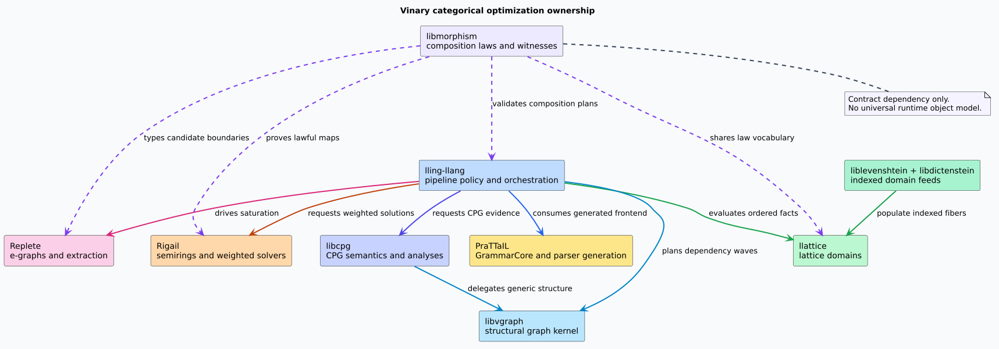
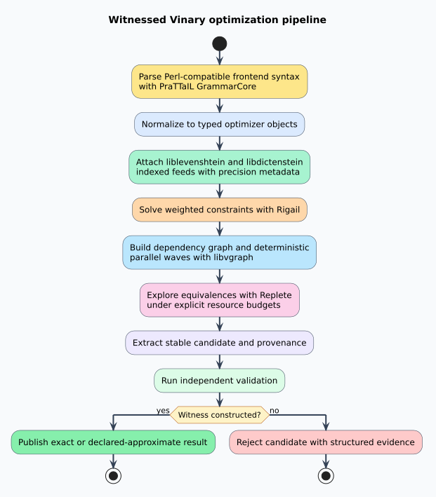

# Ownership and Optimization Pipeline

## Architectural decision

The categorical contract must be independent of lling-llang, while the optimization pipeline must
be orchestrated by lling-llang.

Independence prevents parser, graph, lattice, equation, and equality-saturation libraries from
depending on an optimizer executable or frontend policy. Orchestration belongs in lling-llang
because it chooses which transformations run, connects their endpoints, applies resource policy,
and decides whether a validated candidate may be published.

libmorphism therefore owns laws and compact interoperability contracts. It must never become a
universal intermediate representation, dependency-injection framework, or dynamically dispatched
category interpreter.

## Component responsibilities

| Component | Owns | Does not own |
|---|---|---|
| libmorphism | Typed composition laws, effects, precision, completeness, structure-preserving maps, validation witnesses | Concrete parsers, e-graphs, lattices, graph algorithms, or optimizer policy |
| lling-llang | Pipeline planning, policy, orchestration, budgets, candidate validation, publication | General parser generation or shared algebra implementations |
| PraTTaIL | General-purpose parser generation and `GrammarCore`; the future lling-llang frontend grammar | Optimization policy or e-graph saturation |
| Replete | Equality graphs, congruence maintenance, rewrites, analyses, and extraction mechanics | Language parsing or cross-library truth claims |
| Rigail | Semirings, weighted equations, solvers, and structure-preserving weighted maps | Lattice ownership or parser generation |
| llattice | Lawful lattice, join, meet, and ordered-domain structures | Weighted path extension or equality saturation |
| liblevenshtein | Edit-distance domains, cost monoids, automata, and indexed observations | Generic lattice or morphism laws |
| libdictenstein | Dictionary-indexed lattice feeds and domain operations | Optimizer orchestration |
| libvgraph | Stack-safe deterministic structural graph analysis and dependency waves | Code property graph semantics or e-graph equivalence |
| libcpg | Code property graphs, language-facing analysis, queries, and upcoming CPG features | The generic structural kernel already extracted as libvgraph |

libcpg can consume libvgraph when doing so preserves its established semantics and performance.
It need not depend on libmorphism merely to be “categorical.” Beneficial libcpg capabilities should
cross the boundary as explicit CPG analyses, adapters, or evidence producers. Generic graph
algorithms belong in libvgraph; cross-stage composition laws belong here.

## Frontend boundary

When PraTTaIL's `GrammarCore` is ready, PraTTaIL generates the frontend parser and lling-llang
consumes it. The selected grammar surface is the Perl-compatible regular-expression syntax already
used by MeTTaIL, not the separately authored string-escaped syntax. That syntax decision is a
frontend policy and must not leak into GrammarCore's general parser-generator abstractions.

Until GrammarCore and the standalone PraTTaIL repository pass their migration gates, the frontend
integration task remains blocked. The same rule applies to Replete-dependent equality-saturation
work while the Dovetail-to-Replete extraction and rename are in progress.

## End-to-end pipeline

The intended flow separates construction, exploration, validation, and publication.

1. **Parse.** PraTTaIL produces a typed frontend representation from the Perl-compatible syntax.
2. **Normalize.** Pure morphisms translate frontend forms into canonical optimizer objects.
3. **Attach feeds.** liblevenshtein and libdictenstein observations enter through explicit indexed
   adapters carrying precision and completeness.
4. **Solve weights.** Rigail supplies lawful weighted choice and extension without conflating
   semiring multiplication with lattice meet.
5. **Analyze dependencies.** libvgraph partitions dependency cycles and emits deterministic
   acyclic waves; libcpg may contribute CPG-specific evidence.
6. **Explore equivalence.** Replete applies validated rewrites and e-class analyses under explicit
   budgets.
7. **Extract.** A cost model chooses candidates while retaining provenance and declared precision.
8. **Validate.** Independent checks construct a witness. Exact publication requires exact inputs
   and independent confirmation.
9. **Publish or reject.** lling-llang commits a witnessed result or returns a structured reason.

The pipeline may skip optional stages only through a typed identity transformation whose effect,
precision, and completeness declarations make the omission observable.

## Compatibility contracts

A future object or transformation can take full advantage of the pipeline only if it provides the
following information. These are semantic requirements, not final Rust trait names.

| Contract | Requirement | Optimization value |
|---|---|---|
| Stable object identity | Source and target domains have stable, collision-safe identities | Rejects invalid composition before execution |
| Typed endpoints | Every transformation declares its source and target | Enables static planning and adapter discovery |
| Identity | Each object domain supplies a behaviorally neutral transformation | Makes optional stages explicit and lawful |
| Associative composition | Regrouping preserves output, effects, evidence order, precision, and completeness | Enables fusion, chunking, and staged execution |
| Effect declaration | Reads, writes, allocation, and evidence emission are conservative | Enables safe parallel scheduling |
| Precision declaration | Exact or sound-approximate status cannot self-promote | Prevents unsound optimization claims |
| Completeness declaration | Complete or incomplete status composes monotonically | Preserves search-coverage meaning |
| Validation | Untrusted candidates cannot construct witnesses directly | Establishes a publication boundary |
| Stable equivalence and hashing | Equality and hashing agree and remain deterministic | Supports e-graph interning and cache reuse |
| Resource estimate | Work, memory, and expansion estimates are explicit and saturating | Enforces optimizer budgets before admission |
| Optional algebra | Join, meet, monoid, or semiring operations expose their exact laws | Enables domain-specific fixed points and costs |
| Optional transport | Fiber reindexing or lifting supplies identity and composition proofs | Justifies fibration-based reasoning |

Static generic composition should be the fast path. A dynamic planning layer may type-erase already
validated nodes, but it must retain checked endpoint identifiers and must never make the dynamic
representation the domain libraries' hot-loop API.

## Lawful adapters instead of inheritance

Integration occurs through small adapters located beside the consuming boundary. An adapter may:

- map a liblevenshtein cost into a Rigail weight using a proved semiring homomorphism;
- expose a libdictenstein observation as one value in an indexed llattice fiber;
- turn a Replete extraction into a candidate requiring a libmorphism validation witness; or
- expose a libcpg dependency relation as canonical libvgraph input.

An adapter may not invent exactness, completeness, algebraic laws, or reindexing lifts. If a map is
lossy, it declares that loss in its precision or completeness result.
