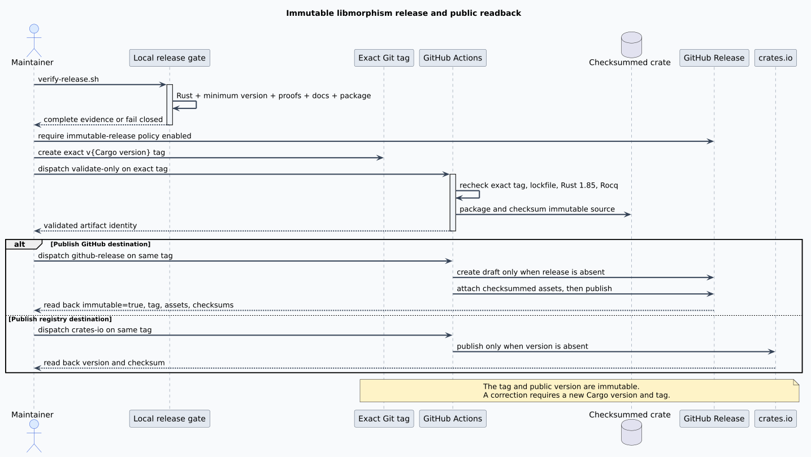

# Release and Provenance Procedure

This procedure publishes one immutable libmorphism source revision as one Cargo package version.
It preserves the connection between the reviewed Git commit, the exact version tag, the tested
crate archive, and each public destination. It does not permit rebuilding or replacing an existing
version.

## Terms and authorities

A **release candidate** is the committed source tree named by the exact tag
`v{Cargo.toml package.version}`. **Provenance** is the evidence connecting that tag to the generated
crate archive and public records. **Public readback** means retrieving a release from its public
destination after publication and checking its tag, version, asset identity, and checksum rather
than trusting only the publishing command's exit status.

The sources of authority are intentionally narrow:

| Claim | Authority |
|---|---|
| Package name and version | Committed `Cargo.toml` |
| Dependency resolution | Committed `Cargo.lock` |
| Source identity | Exact annotated and protected Git tag |
| Package contents | `cargo package --locked --list` |
| Archive identity | `SHA256SUMS` generated by the release workflow |
| GitHub asset immutability | Repository immutable-release policy and public `immutable: true` readback |
| Public availability | Independent GitHub and crates.io readback |

The workflow follows Cargo's published package rules, including the registry rule that an uploaded
version cannot be overwritten. See the
[Cargo package command](https://doc.rust-lang.org/cargo/commands/cargo-package.html) and
[Cargo publishing reference](https://doc.rust-lang.org/cargo/reference/publishing.html).

## End-to-end flow



The diagram separates validation from publication. `validate-only` constructs and verifies the
same crate candidate without mutating either public destination. A later destination-specific run
must use the same exact tag and repeats every remote gate before it can publish.

```text
procedure PUBLISH-IMMUTABLE-VERSION(destination)
    read the package version from committed Cargo.toml
    require the current ref to be the exact tag named v{version}
    require Cargo.lock to be committed and internally consistent
    verify Rust, the minimum Rust version, formal proofs, docs, and package contents
    build the crate archive and verify its recorded checksums
    require the selected public destination not to contain this version
    publish exactly once using least-privilege destination credentials
    read the public record back and compare its tag, version, and checksums
    retain the workflow URL, commit identity, and readback evidence
end procedure
```

Every line is an admission condition. Failure stops the procedure; a failure cannot be interpreted
as a partial success.

## Prepare and validate

1. Confirm that `CHANGELOG.md` describes the version and that all intended files are committed.
2. Run the complete local gate from the repository root:

   ```bash
   scripts/verify-release.sh
   ```

   The wrapper enters a systemd user scope with a 4 GiB resident-memory ceiling, disabled swap, a
   one-core CPU quota, one Cargo build job, and at most 64 tasks. All build, solver, renderer,
   package, log, and temporary files remain under the repository's ignored `target/` tree on
   persistent storage. If a user-level Cargo configuration exists, the gate overlays only that
   file with an empty read-only file so host-local source patches cannot affect release evidence.

3. Inspect `target/verification/` and the package-content list. The gate covers:

   - stable Rust formatting, checks, Clippy, tests, doctests, and rustdoc;
   - the Rust 1.85 minimum-supported-version matrix for `std` and `no_std`;
   - exhaustive and randomized refinement tests plus the 64 KiB stack stress test;
   - Rocq proofs, Temporal Logic of Actions (TLA+) model checking, TLA+ Proof System (TLAPS)
     obligations, and Z3 countermodels;
   - deterministic PlantUML rendering and read-only `vinary-doc-lint` validation;
   - workflow YAML, shell, and Python linting; and
   - two locked Cargo package constructions with byte-identical archives.

4. Commit the exact accepted tree. The worktree must be clean before tagging.
5. Require a repository ruleset that prevents update or deletion of tags matching `v*`. The
   release repository uses no bypass actors.
6. Before creating the tag, require the repository immutable-release setting to report
   `enabled: true`. This setting applies only to future releases and cannot repair a release that
   was published while it was disabled.
7. Create and push an annotated `v{version}` tag that names the accepted commit. Lightweight tag
   objects fail the remote release contract.
8. Dispatch `.github/workflows/release.yml` on that tag with `registry=validate-only`. Retain the
   successful workflow URL and exact commit identity. Every third-party action is pinned to a
   reviewed full commit identity, and the release toolchain is pinned to Rust 1.97.1.

## Publish and read back

Run each requested destination as a separate manual dispatch on the same exact tag:

- `registry=github-release` creates a draft only if no release already owns the tag. It attaches
  the crate archive, `PACKAGE-CONTENTS.txt`, and `SHA256SUMS` before publishing the draft. The job
  then requires the public release record to report repository-enforced `immutable: true` and
  refuses replacement. The pre-tag maintainer check is distinct because GitHub requires
  repository Administration-read permission for the
  [immutable-release setting endpoint](https://docs.github.com/en/rest/repos/repos#check-if-immutable-releases-are-enabled-for-a-repository),
  which the publication job's least-privilege `GITHUB_TOKEN` does not possess.
- `registry=crates-io` queries the exact package version before requesting a short-lived OpenID
  Connect publishing token. It downloads the validated artifact, verifies its checksums,
  independently reproduces the archive byte for byte, and refuses to invoke `cargo publish` if the
  version is already public.

After each successful dispatch, perform independent readback:

1. Resolve the public record by exact tag or exact package version.
2. Confirm its source commit and publication status. A GitHub release must report
   `immutable: true`.
3. Download public GitHub assets and run `sha256sum --check SHA256SUMS` in an empty directory on
   persistent storage.
4. Download the crates.io archive, calculate its SHA-256 digest, and compare it with the registry's
   checksum response.
5. Record the public URLs, timestamps, digests, workflow run identities, and readback results in the
   pgmcp release task.

## Failure and correction semantics

Validation failures require a source correction, a new local gate, and a new accepted commit before
tagging. Publication failures before a destination creates a public record may be retried on the
same tag after diagnosing the failed workflow. Once a destination contains the version, the
workflow deliberately rejects another publication attempt.

Never move a release tag, overwrite a GitHub release, or attempt to replace a crates.io archive. A
defect discovered after publication is corrected by incrementing `Cargo.toml`, documenting the
change, and repeating this procedure with a new tag. This preserves downstream reproducibility and
keeps the formal, executable, and public evidence aligned.

Enabling GitHub release immutability after a release exists protects only later releases. Such a
release remains a historical public record and must be superseded by a new version; it must never
be described as repository-enforced immutable.
