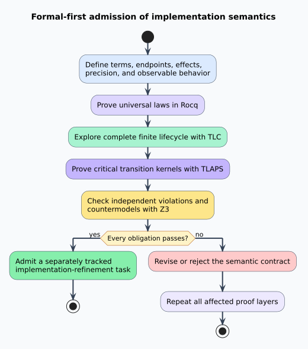

# Verification Model and Scientific Evidence

## Claims under test

The formal development evaluates eight claim families:

1. endpoint-checked composition is associative and has identities;
2. declared effects compose associatively with an empty identity;
3. exactness and completeness never promote through composition;
4. validation witnesses are constructible exactly when their checks succeed;
5. semiring homomorphisms preserve natural order, while order reflection requires injectivity; and
6. indexed families are fibers but need not admit fibration lifts;
7. the Rust representation preserves endpoint, evidence, provenance, and witness boundaries; and
8. irreversible release publication follows policy, protected-tag, validation, asset, and
   immutability preconditions.

The evidence matrix separates universal proofs, finite-state exploration, and counterexamples.

| Claim | Rocq | TLC | TLAPS | Z3 |
|---|---:|---:|---:|---:|
| Typed identities and associativity | Proof | — | — | — |
| No exact promotion | Proof | 25 reachable states | Logical kernel | Unsatisfiable violation |
| Witness before publication | Proof | 25 reachable states | Logical kernel | Unsatisfiable exact-without-confirmation case |
| Algebra preservation | Proof | — | — | Satisfiable noninjective countermodel |
| Invalid algebra conflations | Constructive counterexamples | — | — | Satisfiable multiplication/meet countermodel |
| Fiber versus fibration | Constructive counterexample | — | — | — |
| Rust representation refinement | Proof plus correspondence tests | — | — | — |
| Immutable release ordering | — | 9 reachable states | Three logical kernels | — |

## Formal-first sequence



The sequence is deliberately one-way until the contract is accepted:

```text
procedure ADMIT-IMPLEMENTATION(contract_change)
    define every term and observable behavior
    prove general laws constructively in Rocq
    exhaust finite lifecycle behavior with TLC
    prove critical TLA+ transition kernels with TLAPS
    seek independent violations and countermodels with Z3
    if any obligation fails
        revise or reject the contract change
    else
        permit an implementation refinement task
end procedure
```

This is literate pseudocode: each line names an evidence-producing phase and explains why an
implementation is not yet authorized. It does not claim that bounded exploration proves unbounded
behavior.

## Rocq interpretation

The Rocq development is constructive and contains no axioms or admissions. `Print Assumptions`
asks the kernel which assumptions each selected result depends on. The expected response is
`Closed under the global context` eighteen times.

The model uses a decidable endpoint comparison, so composition returns an option. This mirrors an
implementation boundary where independently produced transformations may need runtime endpoint
validation. A future statically typed API may make that failure unrepresentable; its erasure must
still refine the same partial semantics.

## TLA+ interpretation

The TLA+ evidence uses two deliberately separate state machines. `PrecisionLifecycle.tla` consists
of a lifecycle phase, two immutable input exactness flags, result exactness, witness validity, and
publication status. TLC explores all four combinations of input flags and all enabled transitions.
Its checked invariants are:

- every variable retains its declared finite type;
- a result cannot be exact unless both inputs are exact;
- publication requires a witness;
- publication status agrees with the published phase; and
- an exact published result has exact inputs.

TLC currently generates 26 states and finds 25 distinct reachable states at depth four. Those
counts are regression sentinels: an intentional lifecycle extension must update both the model and
the verification script after review.

`ReleaseProtocol.tla` models the deployment boundary separately so package-publishing concerns do
not contaminate the morphism lifecycle. It permits policy enablement and tag protection in either
order. Validation requires the protected tag; draft creation additionally requires the immutable
release policy; publication additionally requires all checksummed assets. The published state is
terminal. TLC generates 21 states, finds 9 distinct reachable states at depth seven, and establishes
that neither a draft nor a public release can be reached without its complete preconditions.

TLAPS proves three propositional kernels in each model. They are spelled out rather than hidden
behind definition expansion; TLC independently connects all six kernels to the named actions across
both complete finite transition systems.

## Independent countermodels

Negative claims are first-class evidence. The Z3 script expects, in order:

1. `unsat`: conjunction-based exactness cannot promote an inexact input;
2. `unsat`: an exact candidate cannot validate without independent confirmation;
3. `sat`: semiring-style path extension can differ from lattice meet; and
4. `sat`: a noninjective map can preserve mapped order while failing to reflect source order.

If a satisfiable countermodel unexpectedly becomes unsatisfiable, that is not automatically an
improvement: it may mean the encoding accidentally asserted the conclusion.

## Threats to validity

- A proved theorem can formalize the wrong requirement. Statement review remains mandatory.
- The finite TLA+ models omit implementation data sizes, API failures, and scheduling timing.
- Z3 checks its own encoding, not the Rocq source.
- Effects are currently conservative booleans; richer regions or capabilities need new laws.
- Executable correspondence covers the selected finite encodings; verifier-specific proof formats
  remain obligations of their verifier implementations.

These limitations define the next evidence required rather than weakening the existing claims.

## Rust correspondence

The [Rust refinement argument](rust-refinement.md) defines the concrete representation and trust
boundary. [`formal/refinement.tsv`](../../formal/refinement.tsv) maps each admitted observation to
a theorem, Rust symbol, and independent test. A change to any mapped element must update all four
artifacts in one reviewable change; a stale path or name fails verification.
