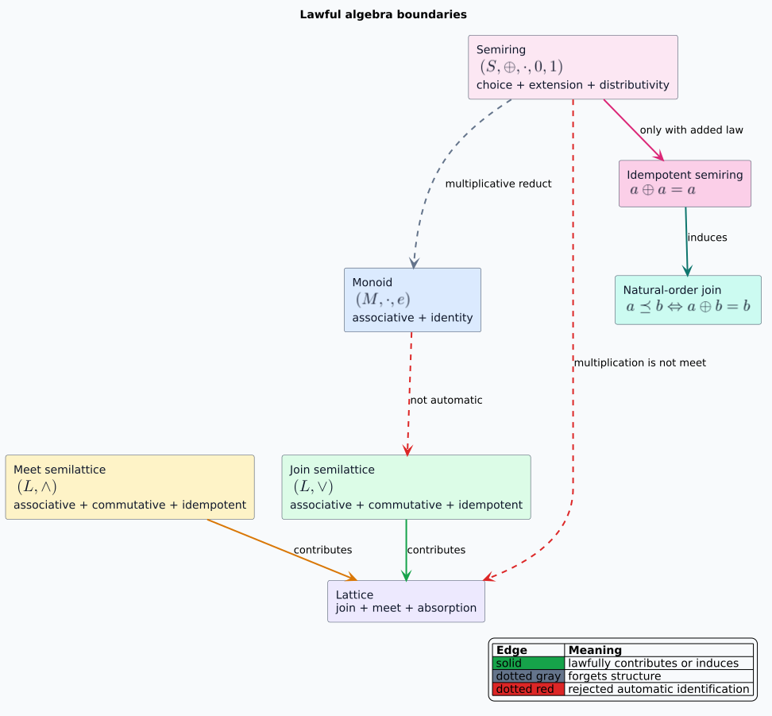
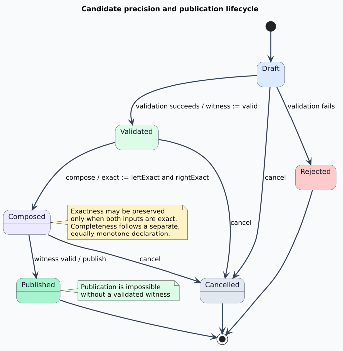

# Composition, Algebra, Fibers, and Effects

## Terms and notation

A **category** has objects, morphisms between objects, identity morphisms, and associative
composition. A **morphism** $`f : A \to B`$ is a typed transformation from source object $`A`$ to
target object $`B`$. Two morphisms $`f : A \to B`$ and $`g : B \to C`$ compose as
$`g \circ f : A \to C`$. They do not compose if the middle endpoints differ.

A **monoid** is a carrier with an associative binary operation and an identity. A **join
semilattice** has an associative, commutative, and idempotent join. A **lattice** has lawful join
and meet operations satisfying absorption. A **semiring** supplies additive choice and
multiplicative extension with identities and distributivity. A **homomorphism** preserves named
operations; an **order embedding** additionally reflects order, which generally requires
injectivity.

These are distinct structures. Sharing vocabulary does not justify sharing an implementation or
silently asserting stronger laws.



## Why composition is useful here

The Vinary campaign already moves information through transformations: parser output becomes
language structure; rewrite systems generate equivalent candidates; graph analyses expose
dependency structure; lattice and weighted feeds contribute facts; and an optimizer selects a
validated result. Typed morphisms make the admissible connections explicit and turn pipeline
construction into endpoint checking.

The core laws are:

```math
f \circ 1_A = f, \qquad 1_B \circ f = f,
```

and

```math
h \circ (g \circ f) = (h \circ g) \circ f.
```

Associativity permits legal regrouping for batching, fusion, staging, or parallel scheduling.
It does not permit reordering. Reordering requires an independent commutation proof that includes
observable effects.

libmorphism records effects in the one-byte `EffectSet`, whose composition is bit-set union. The
formal model and Rust representation track state reads, state writes, allocation, and evidence
emission. `EffectSet::from_bits` rejects unknown meanings rather than silently preserving them.
The type preserves the empty identity, associativity, commutativity, and idempotence; a scheduler
must still reject concurrency that conflicts with declared effects.

## Precision and completeness are independent

An exact result may safely degrade to a sound approximation. A sound approximation may not label
itself exact. Composition therefore uses conjunction for exactness:

```math
\mathrm{exact}(g \circ f)
  = \mathrm{exact}(g) \land \mathrm{exact}(f).
```

Completeness has the same no-promotion shape but a separate meaning. **Precision** asks whether a
reported answer is exact; **completeness** asks whether all required answers were considered. An
exact but incomplete result and a sound, complete approximation are both meaningful states. They
must not be collapsed into one boolean.

A validation witness is constructed only after a decidable check succeeds. An exact candidate
also requires independent confirmation. This makes exactness a validated claim rather than an
optimizer hint.



## Where monoids and semirings apply

Monoids are directly useful for compositional metadata and costs:

- edit operations concatenate with an empty edit script;
- path costs combine with a zero-length-path identity;
- effect sets combine by union with the empty set; and
- diagnostics or evidence may append in a deterministic order.

The operation must match the semantics. Natural-number addition is a monoid, but it is not a
join-semilattice because $`1 + 1 \ne 1`$. Consequently, liblevenshtein's cost accumulation must
not be treated as lattice join merely because both are binary operations.

Rigail's semiring abstraction is the appropriate home for weighted choice and path extension. If
semiring addition is idempotent, it induces the natural order
$`a \preceq b \iff a \oplus b = b`$ and can act as a join. Multiplication remains path extension;
it is not automatically lattice meet. `formal/rocq/Countermodels.v` proves this distinction on a
concrete pair.

A semiring homomorphism preserves zero, one, addition, and multiplication. It preserves the
induced natural order. Reflecting that order requires an injective map; the Z3 and Rocq
countermodels show why a noninjective map is insufficient.

## Do monads apply?

A monad models a kind of computation together with lawful sequencing. It can describe validation,
failure, state, nondeterminism, or asynchronous effects. That makes monadic reasoning useful when
specifying how transformations sequence effects.

It does not follow that Vinary needs a universal higher-kinded `Monad` trait. Rust's type system
does not directly express higher-kinded types, and encoding them throughout hot paths would add
surface complexity without creating new optimization opportunities. Prefer concrete types such as
`Result`, iterators, futures, and explicit state transitions. Introduce a reusable monadic
abstraction only when at least two concrete consumers share the same operation and the identity and
associativity laws can be tested or proved. Moggi's computational interpretation supplies the
theory; it is a design lens rather than a mandate for a runtime wrapper.

## Are lattice feeds fibers?

Yes, when indexed by the key that selects the type or domain of values, a feed is naturally an
**indexed family**. For an index type $`B`$ and family $`E : B \to \mathsf{Type}`$, the total feed
is the dependent sum:

```math
\sum_{b : B} E(b),
```

with projection $`\pi(b, e) = b`$. The fiber over $`b`$ is $`E(b)`$. This accurately describes
liblevenshtein and libdictenstein observations grouped by word, automaton state, snapshot, lattice
point, or another declared index.

The projection is not automatically a **fibration**. A fibration also supplies lawful lifts of
base arrows into the appropriate fibers. `formal/rocq/IndexedFamilies.v` constructs a family with
an arrow into an inhabited fiber but an empty source fiber, so no contravariant lift can exist.
The campaign should call feeds fibers now and reserve “fibration” for an implemented reindexing or
transport operation with identity and composition laws.

## Morphisms around equality saturation

Replete's e-graphs represent many equivalent expressions compactly. A rewrite rule is naturally a
morphism only after its source language, target language, side conditions, effects, and evidence
are explicit. Equality saturation then explores a congruence-closed candidate space; extraction is
a separate cost-guided morphism that must carry precision and validation status.

This separation matters. An e-graph can establish membership in an equivalence class under the
installed rewrite theory, but it does not by itself prove that the theory matches the external
semantics, that extraction found a globally optimal representative, or that an approximate feed is
exact. Those obligations cross the libmorphism witness boundary.

## References

- Saunders Mac Lane, *Categories for the Working Mathematician*, second edition. DOI:
  <https://doi.org/10.1007/978-1-4757-4721-8>.
- B. A. Davey and H. A. Priestley, *Introduction to Lattices and Order*, second edition. DOI:
  <https://doi.org/10.1017/CBO9780511809088>.
- Eugenio Moggi, “Notions of Computation and Monads,” *Information and Computation* 93(1). DOI:
  <https://doi.org/10.1016/0890-5401(91)90052-4>.
- Max Willsey et al., “egg: Fast and Extensible Equality Saturation,” *Proceedings of the ACM on
  Programming Languages* 5 (POPL). DOI: <https://doi.org/10.1145/3434304>.
